# [📈 Live Status](https://status.digirdp.com): <!--live status--> **🟩 All systems operational**

This repository contains the open-source uptime monitor and status page for [DigiRDP,LLC](https://digirdp.com), powered by [Upptime](https://github.com/upptime/upptime).

With [Upptime](https://upptime.js.org), you can get your own unlimited and free uptime monitor and status page, powered entirely by a GitHub repository. We use [Issues](https://github.com/digirdpllc/upptime/issues) as incident reports, [Actions](https://github.com/digirdpllc/upptime/actions) as uptime monitors, and [Pages](https://status.digirdp.com) for the status page.

<!--start: status pages-->
<!-- This summary is generated by Upptime (https://github.com/upptime/upptime) -->
<!-- Do not edit this manually, your changes will be overwritten -->
<!-- prettier-ignore -->
| URL | Status | History | Response Time | Uptime |
| --- | ------ | ------- | ------------- | ------ |
|  US Node 1 | 🟩 Up | [us-node-1.yml](https://github.com/digirdpllc/upptime/commits/HEAD/history/us-node-1.yml) | 

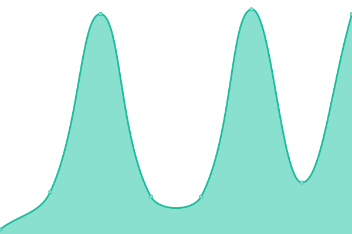 48ms
     
 | 

<a href="https://status.digirdp.com/history/us-node-1">100.00%</a>
    

|  US Node 2 | 🟩 Up | [us-node-2.yml](https://github.com/digirdpllc/upptime/commits/HEAD/history/us-node-2.yml) | 

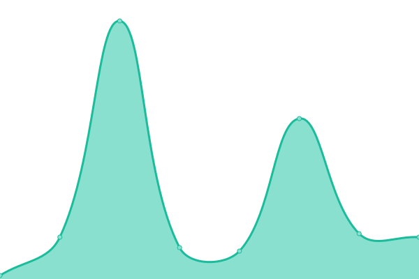 48ms
     
 | 

<a href="https://status.digirdp.com/history/us-node-2">100.00%</a>
    

|  US Node 3 | 🟩 Up | [us-node-3.yml](https://github.com/digirdpllc/upptime/commits/HEAD/history/us-node-3.yml) | 

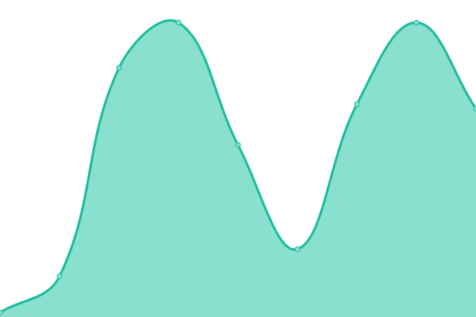 39ms
     
 | 

<a href="https://status.digirdp.com/history/us-node-3">100.00%</a>
    

|  US Node 4 | 🟩 Up | [us-node-4.yml](https://github.com/digirdpllc/upptime/commits/HEAD/history/us-node-4.yml) | 

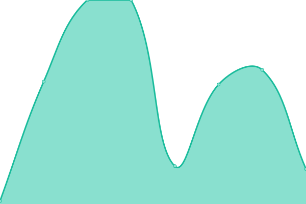 38ms
     
 | 

<a href="https://status.digirdp.com/history/us-node-4">100.00%</a>
    

|  US Node 5 | 🟩 Up | [us-node-5.yml](https://github.com/digirdpllc/upptime/commits/HEAD/history/us-node-5.yml) | 

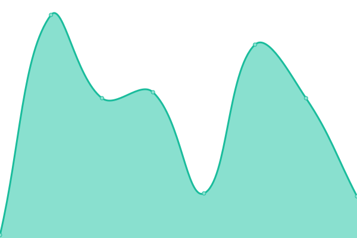 41ms
     
 | 

<a href="https://status.digirdp.com/history/us-node-5">100.00%</a>
    

|  US Node 6 | 🟩 Up | [us-node-6.yml](https://github.com/digirdpllc/upptime/commits/HEAD/history/us-node-6.yml) | 

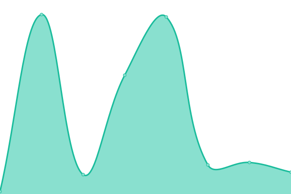 49ms
     
 | 

<a href="https://status.digirdp.com/history/us-node-6">100.00%</a>
    

|  US Node 7 | 🟩 Up | [us-node-7.yml](https://github.com/digirdpllc/upptime/commits/HEAD/history/us-node-7.yml) | 

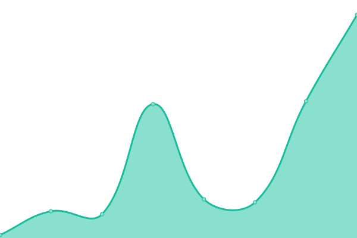 53ms
     
 | 

<a href="https://status.digirdp.com/history/us-node-7">57.01%</a>
    

|  US Node M | 🟩 Up | [us-node-m.yml](https://github.com/digirdpllc/upptime/commits/HEAD/history/us-node-m.yml) | 

 84ms
     
 | 

<a href="https://status.digirdp.com/history/us-node-m">100.00%</a>
    

|  US Node S | 🟩 Up | [us-node-s.yml](https://github.com/digirdpllc/upptime/commits/HEAD/history/us-node-s.yml) | 

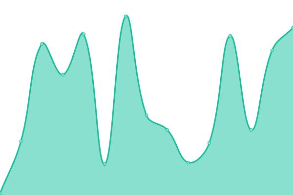 83ms
     
 | 

<a href="https://status.digirdp.com/history/us-node-s">100.00%</a>
    

|  US Node 9 | 🟩 Up | [us-node-9.yml](https://github.com/digirdpllc/upptime/commits/HEAD/history/us-node-9.yml) | 

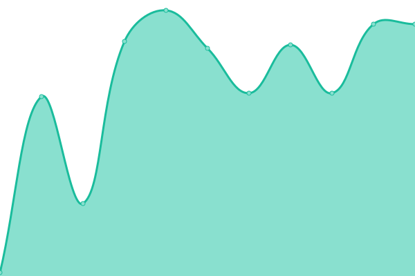 45ms
     
 | 

<a href="https://status.digirdp.com/history/us-node-9">100.00%</a>
    

|  Europe Node 1 | 🟩 Up | [europe-node-1.yml](https://github.com/digirdpllc/upptime/commits/HEAD/history/europe-node-1.yml) | 

 117ms
     
 | 

<a href="https://status.digirdp.com/history/europe-node-1">100.00%</a>
    

|  Europe Node 2 | 🟩 Up | [europe-node-2.yml](https://github.com/digirdpllc/upptime/commits/HEAD/history/europe-node-2.yml) | 

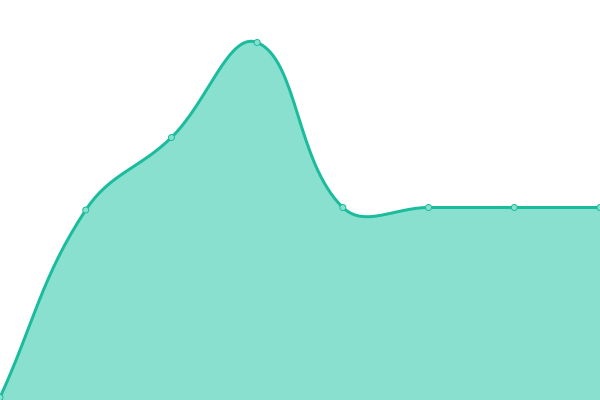 115ms
     
 | 

<a href="https://status.digirdp.com/history/europe-node-2">100.00%</a>
    

|  Europe Node 3 | 🟩 Up | [europe-node-3.yml](https://github.com/digirdpllc/upptime/commits/HEAD/history/europe-node-3.yml) | 

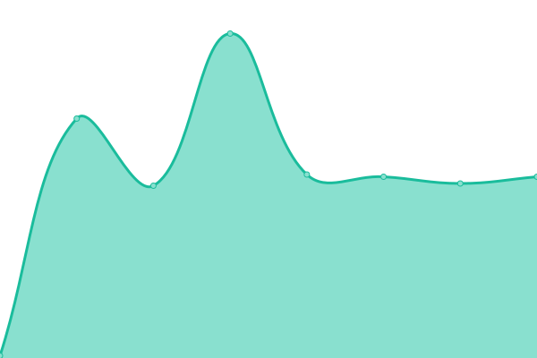 114ms
     
 | 

<a href="https://status.digirdp.com/history/europe-node-3">100.00%</a>
    

|  Europe Node 4 | 🟩 Up | [europe-node-4.yml](https://github.com/digirdpllc/upptime/commits/HEAD/history/europe-node-4.yml) | 

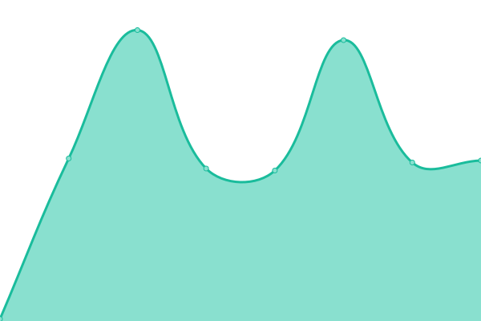 115ms
     
 | 

<a href="https://status.digirdp.com/history/europe-node-4">100.00%</a>
    

|  Europe Node 5 | 🟩 Up | [europe-node-5.yml](https://github.com/digirdpllc/upptime/commits/HEAD/history/europe-node-5.yml) | 

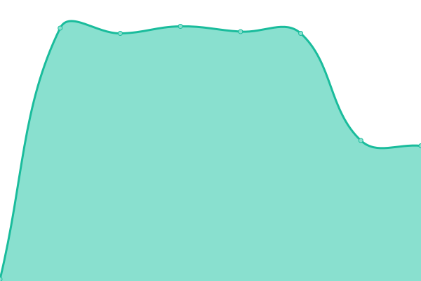 114ms
     
 | 

<a href="https://status.digirdp.com/history/europe-node-5">100.00%</a>
    

|  Europe Node 6 | 🟩 Up | [europe-node-6.yml](https://github.com/digirdpllc/upptime/commits/HEAD/history/europe-node-6.yml) | 

 114ms
     
 | 

<a href="https://status.digirdp.com/history/europe-node-6">100.00%</a>
    

|  Asia Node 1 | 🟩 Up | [asia-node-1.yml](https://github.com/digirdpllc/upptime/commits/HEAD/history/asia-node-1.yml) | 

 229ms
     
 | 

<a href="https://status.digirdp.com/history/asia-node-1">100.00%</a>
    

<!--end: status pages-->

[**Visit our status website →**](https://status.digirdp.com)

## 📄 License

- Powered by: [Upptime](https://github.com/upptime/upptime)
- Code: [MIT](./LICENSE) © [DigiRDP,LLC](https://digirdp.com)
- Data in the `./history` directory: [Open Database License](https://opendatacommons.org/licenses/odbl/1-0/)
